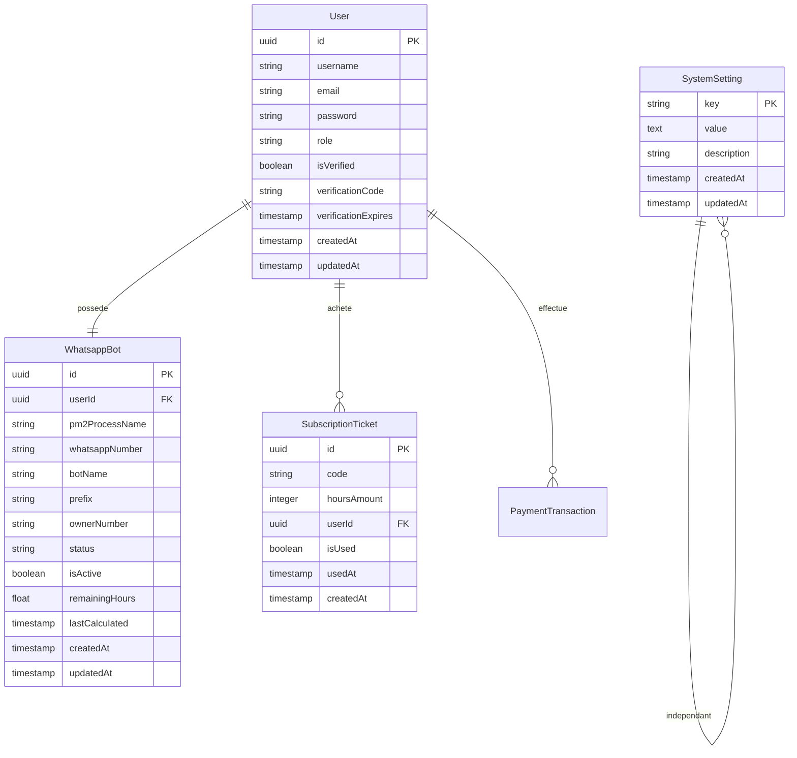

# 📑 PLAN D'ARCHITECTURE DYNAMIQUE : SAAS MULTI-BOTS (MENMA-MD & OVL-MD)

Ce document présente l'architecture globale, la configuration du système de fichiers sur le VPS, le schéma de la base de données PostgreSQL centralisée, ainsi que la logique de synchronisation de session et d'orchestration PM2 pour le SaaS **Menma-MD** et **Ovl-MD**. 

L'architecture est entièrement **dynamique et paramétrable**, permettant à l'administrateur de modifier les variables système globales directly depuis l'interface ou la base de données (nom de l'app, dépôts Git du bot et depot git du site de connexion de session pair et qr , ports, préfixes PM2, etc.), sans modification du code source.

---

## 1. 📂 ARCHITECTURE DES DOSSIERS SUR LE VPS

Pour maximiser l'efficacité de l'espace disque tout en garantissant l'isolation complète des utilisateurs, le VPS utilise un système de répertoire par utilisateur avec un lien symbolique vers un dossier `node_modules` global.

### Arborescence Globale du VPS
```plaintext
/var/www/
├── global_node_modules/             # Dépendances partagées lourdes (Baileys, Axios, Pino, etc.)
│   ├── package.json                 # Définit les versions exactes des dépendances du bot
│   └── node_modules/                # Unique dossier node_modules physique pour toutes les instances
│
├── menma-saas-core/                 # Projet central (Next.js Dashboard + API Express + Sequelize)
│   ├── .env                         # Variables d'environnement globales (PostgreSQL, secrets)
│   ├── package.json
│   ├── node_modules/                # Dépendances propres au SaaS (Sequelize, NextAuth, pg, etc.)
│   └── src/                         # Code source de la console SaaS
│
├── menma-session-service/           # Micro-service d'authentification WhatsApp (Pairing / QR)
│   ├── index.js
│   ├── pair.js
│   └── node_modules/                # Dépendances de session indépendantes
│
└── menma-users/                     # Répertoire d'isolation des instances clients (Configurable via Base de Données)
    ├── user_550e8400-e29b-41d4-a716/ # Dossier basé sur l'UUID de l'utilisateur
    │   ├── index.js                 # Code du bot cloné dynamiquement depuis le dépôt GitHub configuré
    │   ├── package.json             # Fichier original du bot
    │   ├── .env                     # Config locale injectée (BOT_NAME, PREFIX, OWNER_NUMBER)
    │   │
    │   ├── [Nom_Variable].db        # Base SQLite locale propre à ce bot (ex. database.db ou ovl.db)
    │   │                            # Trouvée récursivement par l'orchestrateur (même dans un sous-dossier)
    │   │
    │   ├── auth/                    # Dossier de clés Baileys
    │   │   └── creds.json           # Session d'appairage active (poussée par le site de session)
    │   ├── logs/                    # Redirection des logs PM2 pour l'affichage dans le dashboard
    │   │   ├── out.log              # Logs standards de l'instance
    │   │   └── err.log              # Logs d'erreurs de l'instance
    │   └── node_modules -> /var/www/global_node_modules/node_modules [LIEN SYMBOLIQUE]
```

### Initialisation de l'environnement global sur le VPS
```bash
# 1. Création des répertoires principaux
mkdir -p /var/www/global_node_modules
mkdir -p /var/www/menma-users ou /var/www/ovl-users

# 2. Préparation du package.json de dépendances globales adaptable sur la derniere version du git du bot ou du site de connexion de session pair et qr mais ici c'est un exemple
cat <<EOT > /var/www/global_node_modules/package.json
{
  "name": "bot-global-dependencies",
  "version": "1.0.0",
  "dependencies": {
    "@whiskeysockets/baileys": "^6.6.0",
    "@hapi/boom": "^10.0.1",
    "axios": "^1.6.8",
    "express": "^4.19.2",
    "fs-extra": "^11.2.0",
    "node-cache": "^5.1.2",
    "pg": "^8.11.5",
    "pino": "^9.0.0",
    "sequelize": "^6.37.3",
    "sqlite3": "^5.1.7"
  }
}
EOT

# 3. Installation des packages globaux
cd /var/www/global_node_modules
npm install
```

---

## 2. 🗄️ SCHÉMA DE LA BASE DE DONNÉES GLOBALE (POSTGRESQL - SEQUELIZE)

La base PostgreSQL centralisée gère le fonctionnement et stocke toutes les métadonnées. L'ajout de la table `SystemSettings` permet à l'administrateur de configurer le SaaS dynamiquement.



### Script DDL SQL pour PostgreSQL (Production)
```sql
-- Création des ENUMS
CREATE TYPE user_role AS ENUM ('user', 'admin');
CREATE TYPE bot_status AS ENUM ('active', 'paused', 'expired');
CREATE TYPE transaction_status AS ENUM ('pending', 'success', 'failed');

-- Table des configurations système dynamiques
CREATE TABLE "SystemSettings" (
    "key" VARCHAR(255) PRIMARY KEY,
    "value" TEXT NOT NULL,
    "description" VARCHAR(255),
    "createdAt" TIMESTAMP WITH TIME ZONE NOT NULL DEFAULT CURRENT_TIMESTAMP,
    "updatedAt" TIMESTAMP WITH TIME ZONE NOT NULL DEFAULT CURRENT_TIMESTAMP
);

-- Inserts par défaut (exemples pour Menma ou Ovl modifiables par l'admin)
INSERT INTO "SystemSettings" (key, value, description) VALUES
('APP_NAME', 'Menma Bot', 'Nom de l''application SaaS'),
('BOT_REPO_URL', 'https://github.com/Dr-Djibi/menma-bot.git', 'URL GitHub du Bot à cloner'),
('SESSION_SITE_URL', 'https://session.menma-saas.com', 'URL du service d''appairage WhatsApp'),
('SAAS_WEBHOOK_SECRET', 'secret-generique-session-token', 'Secret partagé entre le site de session et le SaaS'),
('PM2_PROCESS_PREFIX', 'bot-user-', 'Préfixe donné aux instances dans PM2'),
('GLOBAL_NODE_MODULES_PATH', '/var/www/global_node_modules/node_modules', 'Chemin absolu vers le node_modules global'),
('USER_INSTANCES_BASE_DIR', '/var/www/menma-users', 'Dossier racine hébergeant les instances des utilisateurs'),
('DEFAULT_REMAINING_HOURS', '72.00', 'Nombre d''heures d''essai gratuit lors de l''inscription');

-- Table des Utilisateurs
CREATE TABLE "Users" (
    "id" UUID PRIMARY KEY DEFAULT gen_random_uuid(),
    "username" VARCHAR(255) NOT NULL,
    "email" VARCHAR(255) UNIQUE NOT NULL,
    "password" VARCHAR(255) NOT NULL,
    "role" user_role DEFAULT 'user',
    "isVerified" BOOLEAN DEFAULT FALSE,
    "verificationCode" VARCHAR(6),
    "verificationExpires" TIMESTAMP,
    "createdAt" TIMESTAMP WITH TIME ZONE NOT NULL DEFAULT CURRENT_TIMESTAMP,
    "updatedAt" TIMESTAMP WITH TIME ZONE NOT NULL DEFAULT CURRENT_TIMESTAMP
);

-- Table des Bots
CREATE TABLE "WhatsappBots" (
    "id" UUID PRIMARY KEY DEFAULT gen_random_uuid(),
    "userId" UUID UNIQUE NOT NULL REFERENCES "Users"("id") ON DELETE CASCADE,
    "pm2ProcessName" VARCHAR(255) UNIQUE NOT NULL,
    "whatsappNumber" VARCHAR(20),
    "botName" VARCHAR(255) DEFAULT 'Menma Bot',
    "prefix" VARCHAR(10) DEFAULT '.',
    "ownerNumber" VARCHAR(20),
    "status" bot_status DEFAULT 'paused',
    "isActive" BOOLEAN DEFAULT FALSE,
    "remainingHours" DOUBLE PRECISION DEFAULT 72.00,
    "lastCalculated" TIMESTAMP WITH TIME ZONE,
    "createdAt" TIMESTAMP WITH TIME ZONE NOT NULL DEFAULT CURRENT_TIMESTAMP,
    "updatedAt" TIMESTAMP WITH TIME ZONE NOT NULL DEFAULT CURRENT_TIMESTAMP
);

-- Table des Tickets d'Abonnement
CREATE TABLE "SubscriptionTickets" (
    "id" UUID PRIMARY KEY DEFAULT gen_random_uuid(),
    "code" VARCHAR(255) UNIQUE NOT NULL,
    "hoursAmount" INTEGER NOT NULL,
    "userId" UUID NOT NULL REFERENCES "Users"("id") ON DELETE CASCADE,
    "isUsed" BOOLEAN DEFAULT FALSE,
    "usedAt" TIMESTAMP WITH TIME ZONE,
    "createdAt" TIMESTAMP WITH TIME ZONE NOT NULL DEFAULT CURRENT_TIMESTAMP
);
```

---

## 3. ⚙️ LOGIQUE DE L'ORCHESTRATEUR DE BOTS (BACKEND SAAS)

L'orchestrateur de bots intègre une logique de recherche récursive permettant de localiser n'importe quel fichier SQLite (`database.db`, `ovl.db`, ou tout autre nom) dans le répertoire cloné de l'utilisateur (même dans des sous-dossiers), pour vider sa table de session lors de la liaison.

### Recherche Récursive et Nettoyage SQLite (TS/JS)
```typescript
import { exec } from 'child_process';
import fs from 'fs';
import path from 'path';
import { promisify } from 'util';
import { SystemSettingsService } from '../settings/system-settings';

const execAsync = promisify(exec);

export class InstanceOrchestrator {
  
  private async getBaseDir(): Promise<string> {
    const dir = await SystemSettingsService.getUserInstancesBaseDir();
    if (!fs.existsSync(dir)) fs.mkdirSync(dir, { recursive: true });
    return dir;
  }

  private async getUserDir(userId: string): Promise<string> {
    const baseDir = await this.getBaseDir();
    return path.join(baseDir, `user_${userId}`);
  }

  /**
   * Scanne récursivement le répertoire d'un utilisateur pour trouver des fichiers SQLite (.db / .sqlite)
   * Évite node_modules et .git pour optimiser le temps d'exécution.
   */
  private findSqliteDbFiles(dir: string): string[] {
    const results: string[] = [];
    if (!fs.existsSync(dir)) return results;

    const list = fs.readdirSync(dir);
    for (const file of list) {
      if (file === 'node_modules' || file === '.git' || file === 'temp' || file === 'logs') {
        continue;
      }
      const filePath = path.join(dir, file);
      try {
        const stat = fs.lstatSync(filePath);
        if (stat.isSymbolicLink()) continue;

        if (stat.isDirectory()) {
          results.push(...this.findSqliteDbFiles(filePath));
        } else if (file.endsWith('.db') || file.endsWith('.sqlite') || file.endsWith('.sqlite3')) {
          results.push(filePath);
        }
      } catch (e) {}
    }
    return results;
  }

  /**
   * Vile la table 'Session' dans toutes les bases SQLite détectées dans le répertoire utilisateur
   */
  async clearLocalSessionDb(userId: string) {
    const userDir = await this.getUserDir(userId);
    const dbFiles = this.findSqliteDbFiles(userDir);

    const sqlite3 = require('sqlite3').verbose();

    for (const dbPath of dbFiles) {
      try {
        await new Promise<void>((resolve, reject) => {
          const db = new sqlite3.Database(dbPath, (err: any) => {
            if (err) return reject(err);
          });

          db.run("DELETE FROM Session;", (err: any) => {
            db.close();
            if (err) {
              if (err.message.includes("no such table")) return resolve(); // Ignorer si pas de table Session
              return reject(err);
            }
            console.log(`[Orchestrator] Session réinitialisée avec succès dans : ${dbPath}`);
            resolve();
          });
        });
      } catch (dbErr: any) {
        console.warn(`[Orchestrator] Échec nettoyage sqlite ${dbPath}:`, dbErr.message);
      }
    }
  }

  /**
   * Lance le bot via PM2 en lisant dynamiquement le préfixe configuré
   */
  async startInstance(userId: string): Promise<string> {
    const userDir = await this.getUserDir(userId);
    const pm2Prefix = await SystemSettingsService.getPm2Prefix();
    const processName = `${pm2Prefix}${userId}`;
    const outLog = path.join(userDir, 'logs', 'out.log');
    const errLog = path.join(userDir, 'logs', 'err.log');

    try {
      await execAsync(`pm2 describe ${processName}`);
      await execAsync(`pm2 start ${processName}`);
    } catch {
      const command = `pm2 start index.js --name "${processName}" --output "${outLog}" --error "${errLog}" --max-memory-restart 200M --restart-delay 5000`;
      await execAsync(command, { cwd: userDir });
    }
    return processName;
  }
  
  // ... Autres méthodes d'arrêt, redémarrage, mise à jour (pull git) ...
}
```

---

## 4. 🔗 FLUX DU SITE DE SESSION & WEBHOOK DE PUSH

Chaque site de session (celui de Menma ou celui d'Ainz) peut envoyer la session d'appairage à la plateforme SaaS en utilisant l'URL globale de l'API configurée dans le fichier d'environnement.

### Exemple de push dynamique du Site de Session (Express)
```javascript
const axios = require('axios');

// Route d'appairage dans pair.js
if (connection === 'open') {
    isFinished = true;
    const credsData = await fs.readJson(path.join(tempPath, 'creds.json'));

    // Lecture des configurations de déploiement (Menma ou Ovl)
    const saasApiUrl = process.env.SAAS_API_URL; // Ex: https://menma-saas.com ou https://ovl-saas.com
    const saasWebhookSecret = process.env.SAAS_WEBHOOK_SECRET; // Clé partagée

    if (userId && saasApiUrl) {
        try {
            console.log(`[Session Site] Push direct vers ${saasApiUrl}/api/bots/session-callback...`);
            const response = await axios.post(`${saasApiUrl}/api/bots/session-callback`, {
                userId: userId,
                creds: credsData
            }, {
                headers: {
                    'Authorization': `Bearer ${saasWebhookSecret}`,
                    'Content-Type': 'application/json'
                },
                timeout: 15000
            });

            if (response.status === 200) {
                console.log(`✅ Session poussée et bot démarré avec succès.`);
                sessions.set(id, { status: 'success', session: `SaaS-Linked` });
            }
        } catch (pushErr) {
            console.error(`❌ Échec du push vers le SaaS :`, pushErr.message);
            sessions.set(id, { status: 'error' });
        }
    }
    // ... Nettoyage local ...
}
```

---

## 5. 🛠️ AVANTAGES DE CETTE LOGIQUE DYNAMIQUE

1. **Aucun code codé en dur** : Toutes les instances font référence au service de paramètres du SaaS pour déterminer les chemins de déploiement, les dépôts GitHub et les préfixes PM2.
2. **Double Déploiement Simplifié** : Pour déployer le site sous le nom de **Menma-MD**, configurez simplement la variable `APP_NAME = Menma Bot` et `BOT_REPO_URL = [Menma Repo]`. Pour **Ovl-MD**, remplacez par `Ovl Bot` et le dépôt de Ainz. Le reste du code Sequelize/Next.js s'exécute à l'identique.
3. **Nettoyage Universel des Fichiers SQLite** : L'algorithme récursif cherche et nettoie la table `Session` de n'importe quel fichier SQLite présent dans le répertoire de l'utilisateur, ce qui permet à Ovl et Menma d'avoir des noms de bases locaux différents (`database.db`, `ovl.db`, etc.) sans générer d'erreurs système.
et lutilisation de smtp pour les mail de verifiaction et autre 